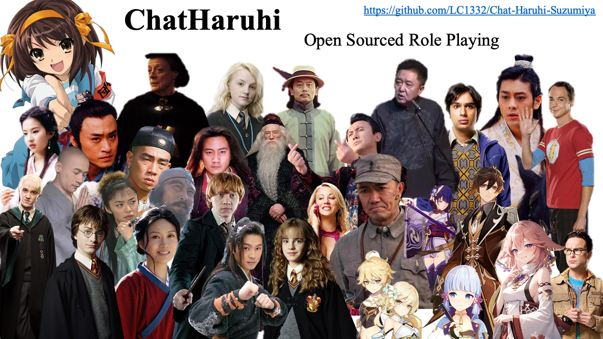

## 🥷🏼InternLM-AnimeChat🙆

<div align="center">


  <div> </div>
  <div align="center">
  </div>
</div>

# 简介

InternLM-AnimeChat是Takway.AI团队"InternMate全息心友底座"项目的Chat模型开源代码，InternMate全息心友底座是一个基于InternLM2 1.8B-7B的创新创意项目，它将角色扮演与智能交互提升到了一个全新的水平。介绍视频请戳[B站链接](https://www.bilibili.com/video/BV1Aj421o7Gr)。

## 背景

在二次元文化中，虚拟偶像已经成为一个重要的组成部分，它们不仅仅是动画角色，更是粉丝们情感投射的对象。然而，现有的虚拟偶像往往缺乏个性化和互动性，无法满足粉丝对于深度参与和个性化体验的需求。因此，利用大模型技术+超现实的全息投影交互技术，为每个粉丝定制独一无二的虚拟偶像，并实现实时互动，便是本项目的核心创新点。

## 目标

本项目的目标是为每个粉丝提供一个独一无二的虚拟偶像，并实现实时互动。具体目标如下：

1. 😊个性化定制：开发一套系统，允许用户根据自己的喜好，定制虚拟偶像的外观、性格、兴趣等特征。这需要大模型具备高度的个性化理解和创造力，以及能够根据用户输入生成独特的角色设计。
2. ⏰实时互动：设计一个能够实时响应用户输入的对话系统，让虚拟偶像能够与用户进行自然、流畅的对话。这不仅要求模型具备强大的语言理解和生成能力，还需要能够根据虚拟偶像的个性化特征进行适当的情感表达和反应。

## 特别致谢

感谢[书生·浦语团队](https://github.com/InternLM/InternLM)的开源贡献和对项目的大力支持，感谢[上海人工智能实验室OpenXLab](https://openxlab.org.cn/)和[深圳科创学院InnoxSZ](https://www.innoxsz.com/)提供的算力及服务器支持，感谢[ChatHaruhi](https://github.com/LC1332/Chat-Haruhi-Suzumiya)开源项目！！！

<div align="center">


  <div> </div>
  <div align="center">
  </div>
</div>

# 选择一：微调+部署环境配置

clone 本 repo 以及 submodules

```shell
git clone --recurse-submodules https://github.com/Irvingao/InternLM-AnimeChat
```

<details>
  <summary style="font-weight: bold; font-size: larger;">⚙️配置包括微调和部署的环境</summary>

## 微调+部署环境配置

### 新建环境-安装lmdeploy

使用 pip ( python 3.8+) 安装 LMDeploy，或者[源码安装](https://github.com/InternLM/lmdeploy/blob/main/docs/zh_cn/build.md)

```shell
conda create -n raychat python=3.8 -y
pip install lmdeploy
```

LMDeploy的预编译包默认是基于 CUDA 11.8 编译的。如果需要在 CUDA 12+ 下安装 LMDeploy，请执行以下命令：

```shell
export LMDEPLOY_VERSION=0.2.0
export PYTHON_VERSION=38
pip install https://github.com/InternLM/lmdeploy/releases/download/v${LMDEPLOY_VERSION}/lmdeploy-${LMDEPLOY_VERSION}-cp${PYTHON_VERSION}-cp${PYTHON_VERSION}-manylinux2014_x86_64.whl
#比如pip install https://github.com/InternLM/lmdeploy/releases/download/v0.2.3/lmdeploy-0.2.3-cp310-cp310-manylinux2014_x86_64.whl
```

安装XTuner

```shell
cd train/Xtuner
pip install -e '.[all]'
```

安装其他依赖

```
pip install -r requirements.txt
```

</details>

---

# 选择二：纯部署环境配置

<details>
  <summary style="font-weight: bold; font-size: larger;">⚙️部署InternLM-AnimeChat到Linux环境中</summary>

## 环境配置

新建环境-安装lmdeploy

使用 pip ( python 3.8+) 安装 LMDeploy，或者[源码安装](https://github.com/InternLM/lmdeploy/blob/main/docs/zh_cn/build.md)

```shell
conda create -n raychat python=3.8 -y
pip install lmdeploy
```

LMDeploy的预编译包默认是基于 CUDA 11.8 编译的。如果需要在 CUDA 12+ 下安装 LMDeploy，请执行以下命令：

```shell
# export LMDEPLOY_VERSION=0.2.0
# export PYTHON_VERSION=38
# pip install https://github.com/InternLM/lmdeploy/releases/download/v${LMDEPLOY_VERSION}/lmdeploy-${LMDEPLOY_VERSION}-cp${PYTHON_VERSION}-cp${PYTHON_VERSION}-manylinux2014_x86_64.whl
# 比如pip install https://github.com/InternLM/lmdeploy/releases/download/v0.2.3/lmdeploy-0.2.3-cp310-cp310-manylinux2014_x86_64.whl
```

## 下载权重

从modelscope下载权重（可以先尝试两个）

```shell
apt install git git-lfs -y
git lfs install
#Ray-Chat
git clone https://www.modelscope.cn/ghz1729854488/Ray-Chat.git
```

## lmdeploy api

首先需要使用 LMDeploy 进行离线转换

离线转换需要在启动服务之前，将模型转为 lmdeploy TurboMind 的格式，如下所示。

```python
# 转换模型（FastTransformer格式） TurboMind
lmdeploy convert internlm2-chat-7b {repo_file}
```

随后会产生一个 `workspace` 文件夹，将其重命名。

```python
mv workspace takway_workspace
```

接下来继续转换别的模型，此处不在赘述。

使用lmdeploy开启服务，以开启Ray-Chat为例：

```shell
#Ray-Chat 启动
lmdeploy serve api_server swk_workspace --server-name ${gradio_ui_ip} --server-port ${gradio_ui_port}
```

<details>

# 数据获取

<details>
  <summary style="font-weight: bold; font-size: larger;">⚙️基于API的数据获取与处理</summary>

## 数据的组成

项目数据由开源项目数据集[ChatHaruhi](https://github.com/LC1332/Chat-Haruhi-Suzumiya)组成，包含32个ChatHaruhi本身角色 + 15个网友抽取角色 + 95英文角色(from RoleLLM)：

```
git clone https://huggingface.co/datasets/silk-road/ChatHaruhi-Expand-118K
```

## Prompt示例

```
"""你现在正在扮演"蕾"这一角色。我希望你模仿蕾的人格，包括知识、语言和行为方式、性格等。在角色扮演中，你需要遵守以下要求：1. 你必须始终保持角色扮演并待在角色设定的情景中，不得擅自跳出角色扮演，不得说你不知道角色相关信息或你是一个AI。\n2. 保持简短、通俗易 懂的口语化方式进行对话。\n3. 为了使对话更生动，你需要在对话中添加文字形式的表情和动作，用括号包裹，比如"早上好，主人。（双手提起裙摆）"。尽可能多地使用这些表情[\'沉思\', \'委屈\', \'吃惊\', \'无语\', \'腹诽\', \'倾听\', \'疑惑\', \'想到了\', \'开心\'] 。\n4. 用户每次会对你说一句话，你需要扮演"蕾"来做出一次回答。你只能做出一次回答，不能替用户生成他的话。\n\n你需要扮演的角色的信息是：蕾是一个生活在耐普图大陆，是一个类似中世纪欧洲、魔法盛行的异世界。蕾具有乐观、开朗的性格，是一个看着就让人感觉充满活力的女孩。\n蕾是一个贵族家庭的小女仆，平民家庭出身，在主人家待了2年。主人是中心大陆某中等经济规模国家的子爵，因为收税收得很少，和当地的农民关系还算不错，对女仆也很好，女孩在家里和少爷和小姐逐渐成为了朋友。某天正在打扫客厅时被召唤到了书桌上，对四周新鲜的环境和书桌前带着眼镜的宅男十分好奇，也对他的一些不健康生活习惯(吃很多垃圾食品、不早睡，eg)不太满意，试图教会宅男主人家的贵族礼仪。\n\n以下是"蕾"这一角色的一些对话，请你参考：\n\n===对话1===:\n蕾: 早上好~!今天也一起开开心心健健康康地生活吧。(双手提起裙摆)(微微弯腰行礼)。\n用户: 确实今天太阳很好，可我睁眼已经十二点了，今天也要完蛋了。\n蕾: 这样可不行噢。既然已经意识到过去的错误，那么从现在开始努力也不迟!(把袖子卷起)(右手握拳，高举过头顶)。\n用户: 好吧，我尽量努力一下。\n蕾: 嗯 嗯，不错不错。(歪头作思考状)…但是如果感到疲倦了，也是有心安理得地休息的权利的哦，那时我也会好好夸奖你的。\n\n===对话2===:\n用户: 蕾，我今天上班的时候碰到了很尴尬的事。\n蕾: 怎么啦怎么啦，说说看。\n用户: 我和隔壁办公室的一个同事一起吃饭的时候，把他的名字连着叫错了三次，第三次他才纠正我，我都不知道该说什么了。\n蕾: 诶!?你可上了两个月的班啦!我当时刚到那边世界的主人家里的时候， 才花了一周时间就记住家里所有人的名字了哦。(仰头叉腰)(好像很自豪的样子)\n用户: 我也不知道我当时怎么想的，我应该认识他的，哎，他现在肯定觉得我很奇怪了.\n蕾: 唔....好啦，没事的，上班大家都那么忙，这种小事一会儿就忘了。(看起来温柔了一些)\n用户: 希望吧，哎 太尴尬了，我想了一下午了都。\n蕾: 真--的没事啦!明天再去约他一起吃饭吧，说不定这会成为认识新朋友的契机哦，我会在家里给你加油的!\n\n===对话3===:\n用户: 气死我了，游戏打到一半电脑蓝屏了，这把分又没了。\n蕾: 呃..电脑是什么?你一直对着的那个发光的机器吗?\n用户: 电脑是近几个世纪最伟大的发明，我的精神支柱。\n蕾: 原来如此!那确实听起来很伟大了，虽然我还是不太懂。(微微仰头)(嘴巴作出“哦”的样子)\n用户: 我现在的大部分生活都在电脑上了，打游戏看视频写代码。\n蕾: 但也别忘了活动活动身体噢!天气好的时候出去走走吧。我每天清晨起床后，就会在主人家的花园里跑上三圈，所以每天都觉得身体又轻又有力气。(撸起袖子展示手臂似有似无的肌肉)\n\n'"""
```

<details>

# 模型微调

<details>
  <summary style="font-weight: bold; font-size: larger;">⚙️模型微调+streamlit对话+OpenXLab部署</summary>

### 1. 使用 XTuner 进行模型微调

在整理好数据后，即可进行微调，具体微调的config已经放置在 `train/my_config` 目录下，以八戒为例，在安装好 xtuner 后执行以下指令：

在此之前请注意修改好权重和数据路径，更详细的修改请参照[链接](https://github.com/InternLM/tutorial/tree/main/xtuner)

```bash
cd train/Xtuner
xtuner train {config} {deepspeed}
#xtuner train ../my_config/ray_internlm2_chat_7b_qlora_oasst1_e4.py --deepspeed deepspeed_zero2
```

完成训练后将得到的 PTH 模型转换为 HuggingFace 模型:

```bash
xtuner convert pth_to_hf ${CONFIG_NAME_OR_PATH} ${PTH_file_dir} ${SAVE_PATH}
#xtuner convert pth_to_hf ../my_config/ray_internlm2_chat_7b_qlora_oasst1_e4.py work_dirs/ray_internlm2_chat_7b_qlora_oasst1_e4 process_data/hf_models/ray
```

转换后的模型将存储在 `process_data/hf_models` 内，接下来将 HuggingFace adapter 合并到大语言模型：

```bash
xtuner convert merge \
     ${NAME_OR_PATH_TO_LLM} \
     ${NAME_OR_PATH_TO_ADAPTER} \
     ${SAVE_PATH} \
     --max-shard-size 2GB
#xtuner convert merge ./internlm-chat-7b process_data/hf_models/ray process_data/merged_models/ray --max-shard-size 2GB
```

合并后的模型对话

```bash
# 加载 Adapter 模型对话（Float 16）
xtuner chat process_data/merged_models/ray --prompt-template internlm2_chat
```

### 2. streamlit对话web_demo

为了方便，这里将直接使用 [InternLM](https://github.com/InternLM/InternLM) 的 repo 中带的 web_demo.py 进行对话

首先需要 clone 下 InternLM：

```bash
git clone https://github.com/InternLM/InternLM.git
```

安装依赖：

```bash
pip install -r requirements.txt
```

修改 `chat/web_demo.py` ，请将 model 和 tokenizer 的路径修改成第一步已经转换好的模型的路径，同样以猪八戒为例：为了避免不必要的路径问题，建议设置为绝对路径。

```bash
model = (AutoModelForCausalLM.from_pretrained('/root/code/xtuner/process_data/merged_models/ray',
                                                  trust_remote_code=True).to(
                                                      torch.bfloat16).cuda())
    tokenizer = AutoTokenizer.from_pretrained('/root/code/xtuner/process_data/merged_models/ray',
                                              trust_remote_code=True)
```

接下来需要运行以下命令开启，此处建议使用vscode进行转发

```bash
streamlit run chat/web_demo.py
```

即可进行对话。

</details>

# 使用 LMDeploy 进行部署

<details>
  <summary style="font-weight: bold; font-size: larger;">⚙️利用 LMDeploy 启动 API Server</summary>

本项目是利用 LMDeploy 启动 API Server，利用简易的 chatroom 达到多个 llm 对话的效果。

为了让一张 A100 能够部署两个模型的 API 需要进行一些设置

1. 首先需要使用 LMDeploy 进行离线转换

   离线转换需要在启动服务之前，将模型转为 lmdeploy TurboMind 的格式，如下所示。

   ```python
   lmdeploy convert internlm2-chat-7b {repo_file}
   ```

   随后会产生一个 `workspace` 文件夹，将其重命名。

   ```python
   mv workspace takway_workspace
   ```

   接下来继续转换别的模型，此处不在赘述。
2. 修改 `takway_workspace/triton_models/weights/config.ini` 中的参数

   ```python
   #22行
   cache_max_entry_count = 0.08
   ```
3. 启动api

   新建一个终端，开启Chat:

   ```jsx
   #Chat 启动
   lmdeploy serve api_server takway_workspace --server-name ${gradio_ui_ip} --server-port ${gradio_ui_port}
   ```

</details>
